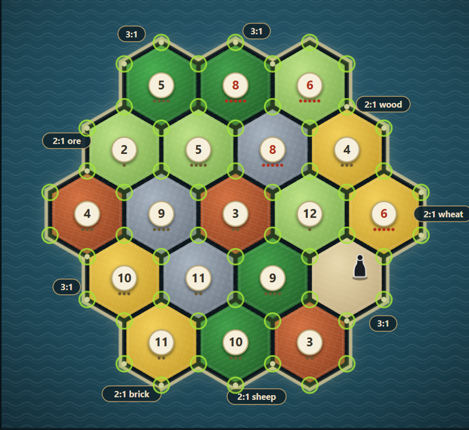
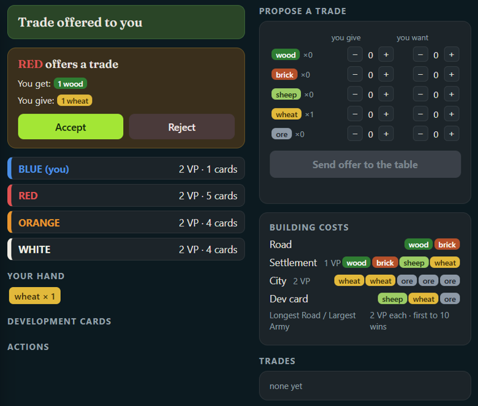
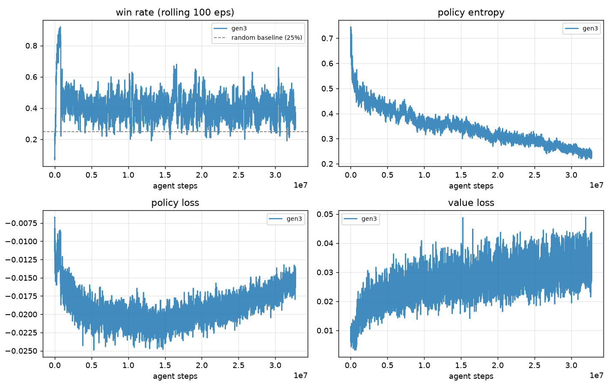

# Catan RL Agent

A self-play reinforcement learning agent for Settlers of Catan — trained
from scratch with PPO on the [Catanatron](https://github.com/bcollazo/catanatron)
engine, capable of trading with a calibrated value function, and playable
in a browser against real people.



## How it works

The agent is a **PPO actor-critic**: board/hand/opponent state feeds a shared
trunk, split into a policy head over ~290 primitive actions (masked to
whatever's legal each turn) and a value head estimating position quality.

**Training is self-play** — one learning policy, opponents sampled from a
pool of its own frozen past checkpoints (plus simple heuristics early on).
Reward is win/loss, reshaped with a potential function so early moves get
gradient before the game ends 300 turns later.

**Trading** isn't in the base engine, so it's a wrapper: any player proposes
a swap, and it's accepted by comparing the trained value function's estimate
of the position before/after. No retraining needed — the same critic that
learned to evaluate positions during self-play prices trades too, once
calibrated into an actual win probability.

**The browser UI** runs the real engine on a small local server; your
browser just polls state and posts choices back — the same interface a bot
uses, which is why trading and dev cards work identically for humans and bots.



## How it was built

Built in this order, because later steps exist *because* earlier ones were
surprising:

1. **Masked PPO + self-play pool.** Baseline that beats random play but
   plateaus fast against a single fixed opponent — fixed by sampling
   opponents from a pool of past checkpoints, tracked with an Elo arena
   (`arena.py`) rather than one win-rate number.
2. **An encoder ablation that failed, usefully.** A relational
   (message-passing) board encoder lost to a plain flat MLP, 13.5% vs 25%
   fair share at matched steps. Cause: it pools all node embeddings into one
   summary *before* the policy picks a specific node to build on, destroying
   exactly the info that decision needs.
3. **A pointer-style action head + distillation warm-start** (`pointer_model.py`,
   `distill.py`) — the fix for #2, cloned from an existing checkpoint instead
   of trained from zero.
4. **A placement-quality bug, found with a purpose-built probe**
   (`probe_placement.py`). Opening settlements looked mediocre; the reward
   potential was pure win-probability, which can't distinguish a great vs.
   terrible opening spot until much later. Adding expected production to the
   potential fixed it, measurably.
5. **Trading, plus a control that changed the design.** The first version
   let both sides "gain" from every trade — impossible in a zero-sum race,
   a miscalibration tell. Fixed with calibration, a *relative*-gain
   acceptance rule, and a control where the same agent proposes random (not
   critic-picked) offers — which collapsed its win rate, proving the
   pricing was doing the work, not just the initiative to propose.
6. **The browser UI**, fixed against bugs found by playing it: a real
   off-by-one (board showed the state *before* the last action), a "spend
   resources, get nothing" report that was a real hidden Victory Point card
   with no UI feedback, and a wall of near-identical "Year of Plenty" cards
   that was the engine enumerating every resource combo as a separate action.

## Setup

```bash
python3 -m venv venv && source venv/bin/activate
pip install torch --index-url https://download.pytorch.org/whl/cpu
pip install catanatron==3.2.1 catanatron_gym==4.0.0 gymnasium==0.29.1 numpy matplotlib
python -m catan_rl.train --smoke --derived --prod-potential 0.4   # sanity check
```

## Training

```bash
nohup nice -n 10 python -m catan_rl.train --iters 8000 \
  --encoder flat --derived --prod-potential 0.4 \
  --warmup-iters 200 --pool-refresh 50 --save-every 200 \
  --seed 0 --out checkpoints/gen3 > logs/gen3.log 2>&1 &
```

`--resume` continues from the last checkpoint. `--encoder {flat,relational,pointer}`,
`--derived` (engineered production features), `--prod-potential` (the
placement-quality fix above).



Win rate vs. a *moving* self-play pool looks flat for long stretches even
while both sides improve — `arena.py`'s Elo is what actually orders
checkpoints by strength.

## Evaluating

```bash
PYTHONHASHSEED=0 python -m catan_rl.evaluate --ckpt A.pt --vs-ckpt B.pt --games 200 --trade agent
PYTHONHASHSEED=0 python -m catan_rl.arena --ckpts A.pt B.pt C.pt --baselines weighted random --games 80
python -m catan_rl.probe_placement --ckpt A.pt --games 50
```

`PYTHONHASHSEED=0` matters — heuristic opponents iterate hash-ordered
collections, so without it identical commands give different games.

## Trading

```bash
python -m catan_rl.calibrate --ckpt A.pt --games 60   # V -> win-probability map
python -m catan_rl.evaluate --ckpt A.pt --vs-ckpt B.pt --games 200 --trade agent
```

`--trade agent` (only the evaluated agent proposes) is the mode that can
show an effect; `--trade table` (everyone proposes) is symmetric and can't
move relative standing by construction.

## Playing it yourself

```bash
python -m catan_rl.play --ckpt checkpoints/gen3/ckpt_08000.pt --port 8377 --trade
```

Tunnel `8377` to your laptop and open `http://localhost:8377`. You're BLUE;
the checkpoint plays the rest. For friends on other devices:

```bash
python -m catan_rl.lobby --ckpt checkpoints/gen3/ckpt_08000.pt --port 8377 --share
```

`--share` opens a public tunnel and prints a link anyone can open directly.

## Results

- **Flat MLP beat relational**, 13.5% vs 25% fair share — see #2 above.
- **Production-potential shaping fixed opening placement**: ~80% → ~85%
  choice-percentile (`probe_placement.py`), reproducible across runs.
- **Trading only helps when priced well**: calibration + relative-gain
  acceptance took a fixed matchup from 60.5% → 87.5% win rate. Control
  (random instead of critic-picked offers) collapsed the same agent to 3%,
  confirming the pricing — not just proposing — was the source of the gain.

## Known limitations

- gen3 rests on a single training seed (the earlier, superseded recipe was
  validated across three).
- Trading is a decision-time heuristic on a policy that never saw trading
  during training; folding trade-proposal into the masked action head is the
  natural next step.
- The pinned engine doesn't enforce "can't play a dev card the turn you
  bought it" — `play.py` enforces this as a human-only house rule, since
  trained checkpoints never saw that restriction.
- No human-evaluation numbers yet — the lobby works, but no game night has
  been run.
